# Fapel-System - The Adult Media Organizer

**Tag, Rate and Enjoy your porn collection!**

:eggplant: :sweat_drops: :peach: :cherries: :movie_camera: :lollipop: :hotdog: :eggplant: :sweat_drops: :peach: :cherries: :movie_camera: :lollipop: :hotdog:

With the fapel-system you can organize your **adult images and video collection** under Linux with standard folders. Everything works with hardlinks.

The fapel-system was created and is optimized for adult-oriented images, videos and movies (Pornography / Porn / Pron). Fapel stands for "fap-able element" :-) If you are a passionate collector, this might be for you.

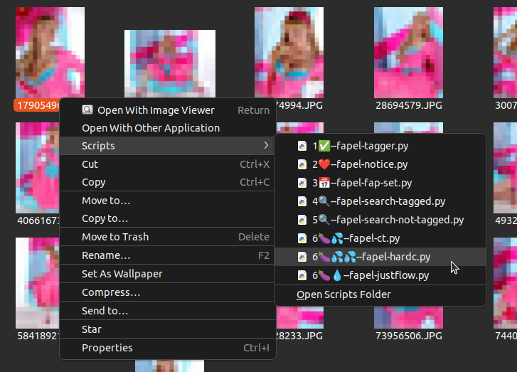

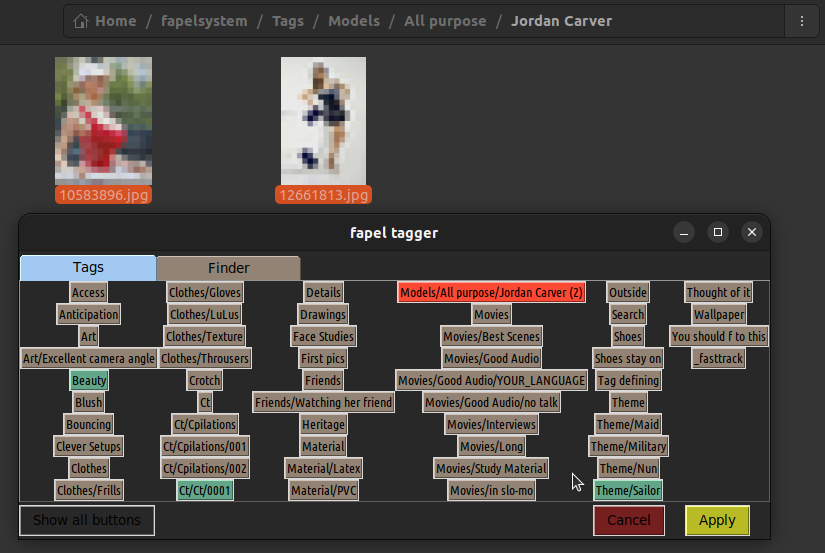

> :eggplant: :sweat_drops: *Note: All sample images on this page are censored*

---

# Start now!

- [Installation](#installation)
- [First steps!](#usage)
- [Technical stuff](#technical-stuff)

---

# Comparison with other Systems
advantages over database based systems

* works with every file type, jpg, gif, mov, mp4,...
* respects **your** privacy! No database, no server connection -- just your files! Dedicated to [Ancilla Tilia](https://en.wikipedia.org/wiki/Ancilla_van_de_Leest), former fetish model and privacy activist.
* backup compatible
* Survives itself (software not needed to browse categories, since these are normal folders)
* perfectly integrated into linux
* files can be renamed and moved (on the same drive) in any other program without problem
* everything is mouse only (one hand)
* fixed positions of tag buttons in the GUI, so you remember them by their location
* delete hardlinks without consequences

# Requirements

* Ubuntu Linux (all other linux systems might require you to install by hand)
    * ... with Nautilus file manager (should be standard)
* Python 3 with tkinter
* all folders and fapels must be on one logical drive because everything works with hardlinks

---

# Installation

## Clone or download this repo

Yes, clone or download this repo now!

## Install python tkinter and pillow

`sudo apt-get install python3-tk python3-pil.imagetk`

## Run install.sh

In `fapelsystem/` run

`sudo install.sh`

> :eggplant: :sweat_drops: *If you are new then let the fapelsystem create the dirs (`y`). Otherwise you have to change the config file yourself (NOT recommended for new users!)*

---

# First steps!

## Starting fapel_tagger

Now go to the media you like and start tagging!

I have this collection of images of Jordan Carver, let's add some tags!

Rightclick to start the tagger

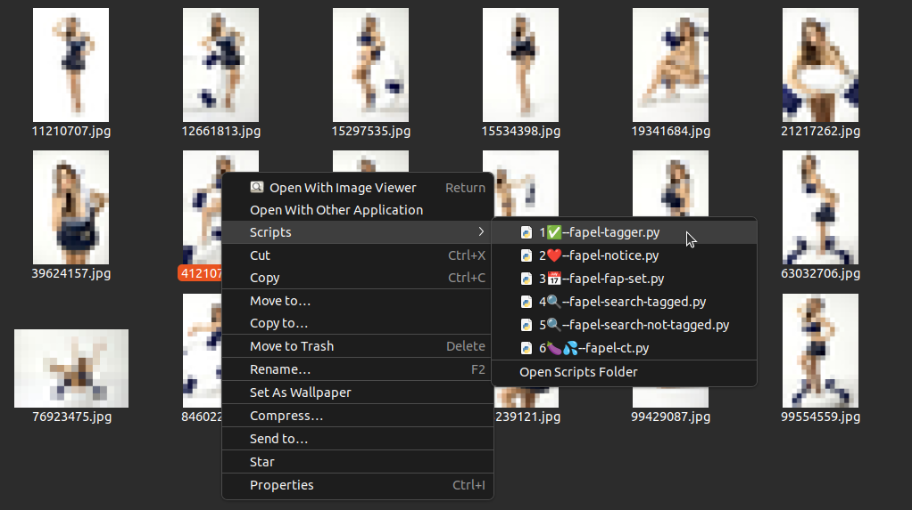

This is the fapel_tagger! It presents all tags for you as buttons you can press to select or deselect a tag!

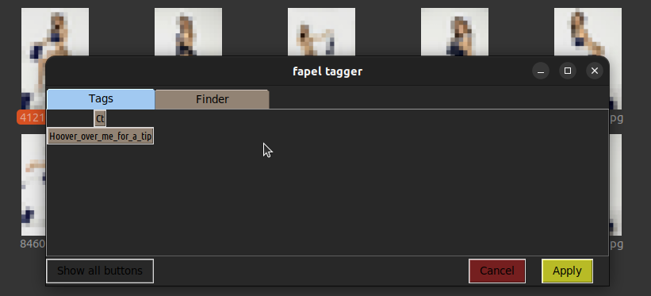

There are almost no buttons... We are missing Tags! Let's create some!

## Create Tags

Go to

`~/fapelsystem/Tags/`

And just create directories and nested directories as you like! These are your Tags!

You can also delete directories (delete Tags) as you like.

## Add Tags to media

Back to the images, rightclick and start the fapel-tagger.

It will now automatically have all the tags you created (as directories). I have created a few:

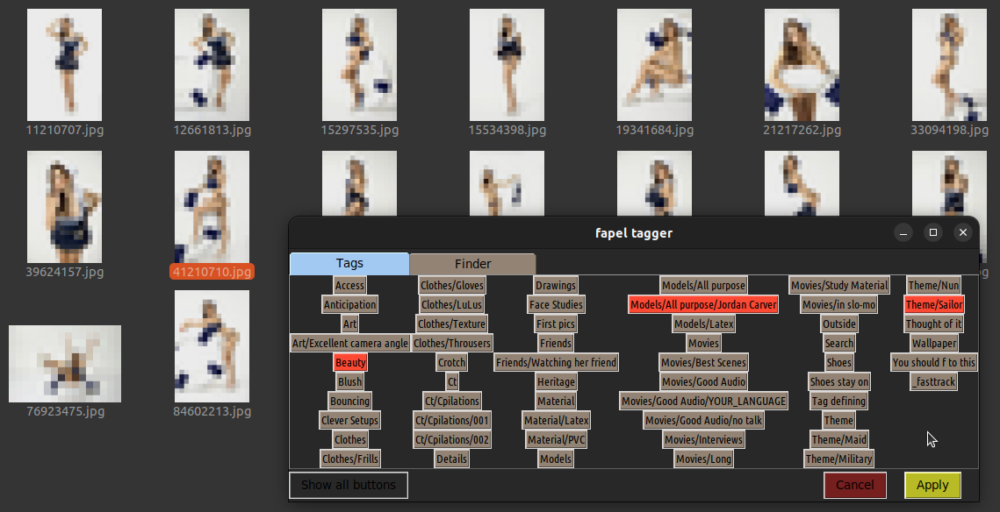

Click the buttons, they will turn red. Red tags are selected.

Click Apply Button

The image is now tagged!

## Browse Media in Tags

Go to the Tag folder, in my example

`~/fapelsystem/Tags/Models/All purpose/Jordan Carver/`

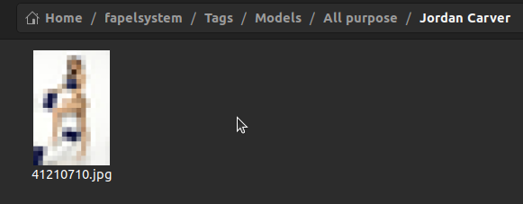

There it is! The image was automatically hard-linked into the Tag folder!

## Tag multiple files

Of course you can tag more than one file in the go.

Just start the tagger with more files:

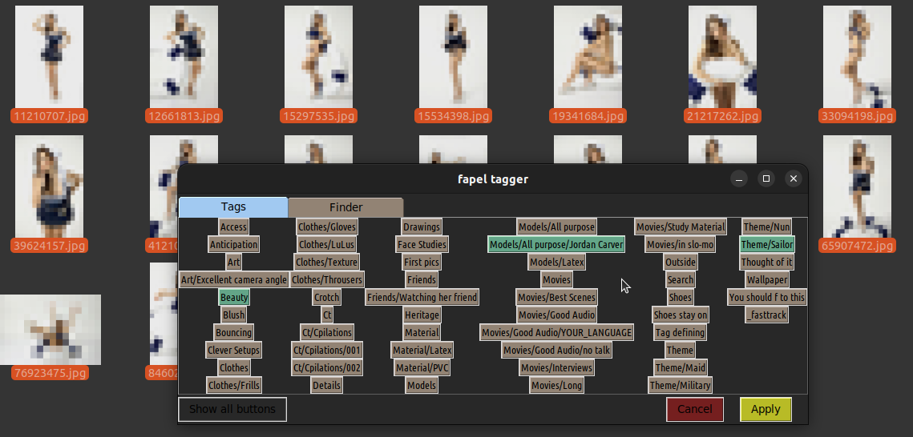

Here the tagger noticed that one file is already tagged (the buttons are blue). Let's add all the other files to the tags except tag "Beauty":

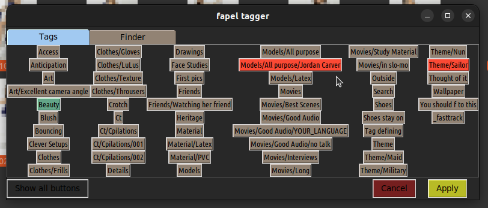

## Add a fav to a file ("notice a file")

Browsing through my collection, this shiny red image caught my attention:

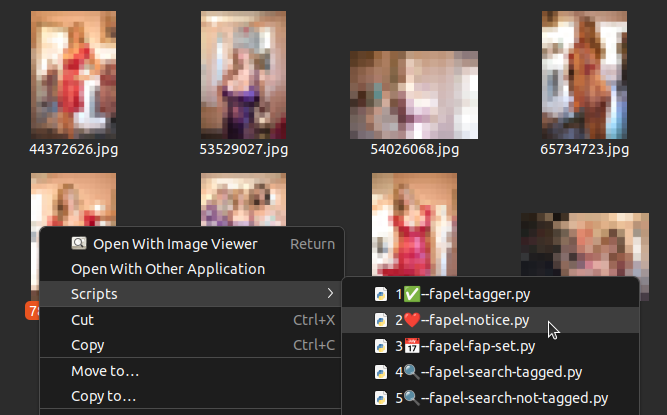

Rightclicking and running the fapel-notice script!

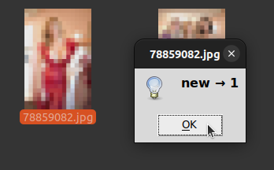

This adds the image to the "notice dir":

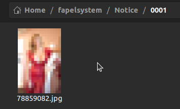

Which as you can see ("0001" sub dir) remembers how often I started the "notice script" on the image!

The image will automatically move the numbered folders up!

Running notice script again:

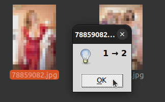

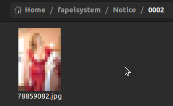

Now it is in the sub folder "0002".

## "Enjoy" a media file

So, notice script counts "events" you noticed some file. The same is true for the "ct" script, except it's purpose is to count how many times you "enjoyed" a file ;-)

> :eggplant: :sweat_drops: *Note: Ct stands for "C.m to", not count, not computer tomography* :smirk:

Oh this beach wear image...

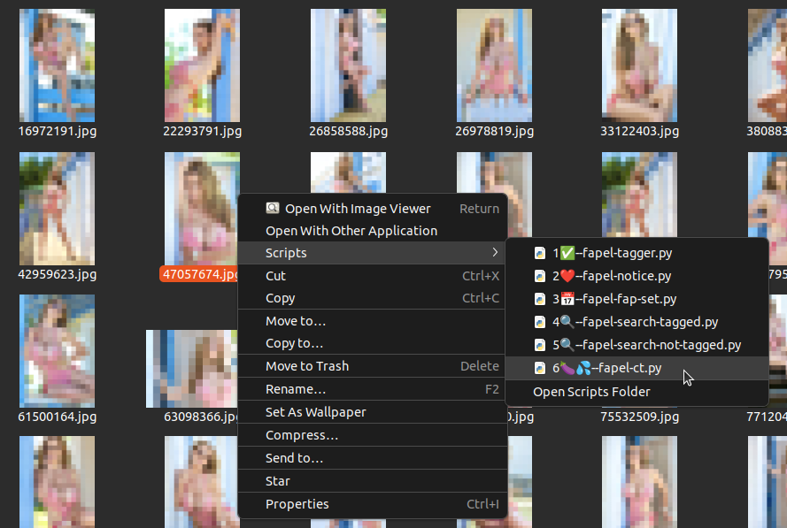

So clean the mouse and run the ct script!

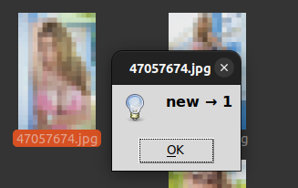

Now run the tagger and see that the ct - counting directory is also present (Ct/Ct/0001)!

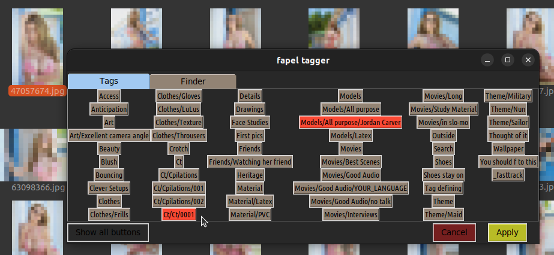

This is important to know:

* The ct directory is inside the /Tags folder, the /Notice directory is outside. So you only see the ct hardlinked media!
* BUT You only see the ct and numbered dirs when a file was tagged! This is to prevent cluttering the tag button gui.

> :peach: *Tip: If you want to see all buttons, press the button in the bottom left corner!*

## Remember today's favorites

Maybe I find some pictures worth a second, condensed visit for today (let's assume it's 2022-01-01).

This one

and this one 

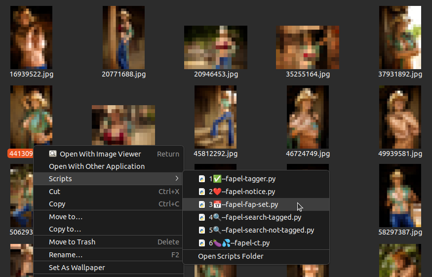

both times I use the "fapel fap set" script.

And I add some more pics.

This creates a folder based on today's date (here 2022-01-01) and puts the images into that folder:

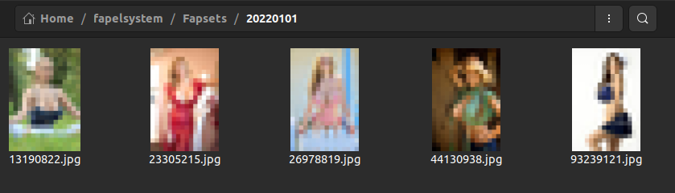

There I can get to my today's favorites!

Nice feature: The "roll over" to the next day and thus the next folder happens not at 0:00 midnight but at 4:00 AM. You can configure that in the config file.

## Search and filter tagged or untagged media

How to find out which images in this folder are tagged?

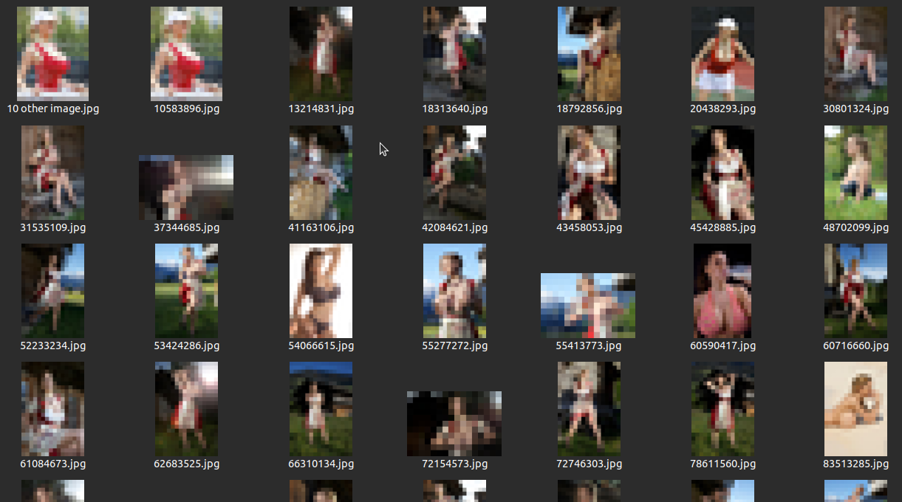

I go one folder up and run the "search tagged" script on the folder:

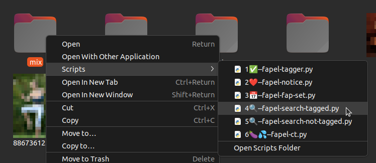

This creates a search folder based on current date and time (in this example it's 2022-01-01 12:34:56) and hardlinks all tagged media into it:

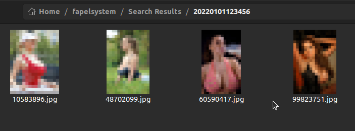

(Of course, the not-tagged script does the exact opposite ;-) )

## Rank your pictures

With the fapel_elo you can rank your images and decide which one is better (as in chess's ELO rating ;-) )

*(Again, bear in mind that the images on this page are censored -- of course normally you would see your images as you know them :-) )*

The GUI is quite simple: Two images from your Tags folder are presented at random.

While hoovering over the window:

- Press the left mouse button to favor the left image
- Press the right mouse button to favor the right image

> :eggplant: :sweat_drops: *Note: If you prefer to click on the images with your left mouse button only, press the "Mouse Mode" button to toggle the mouse behaviour. You then of course have to click on the winning image.*

To prevent accidential ranking you have to press the button 3 times. The *other* image will consequently dim until a new set of images is presented.

Your images are ranked in the elo folder (normally ~/fapelsystem/Elo/ ) by name (ascending numbering), so lowest number is the best!

### Example

In this example we have the elo program opened and the elo directory in the background.

Let's favorite the right image, which is currently lower ranked in the directory as the left image:

After clicking right to favor the right image, the left image starts to turn dark.

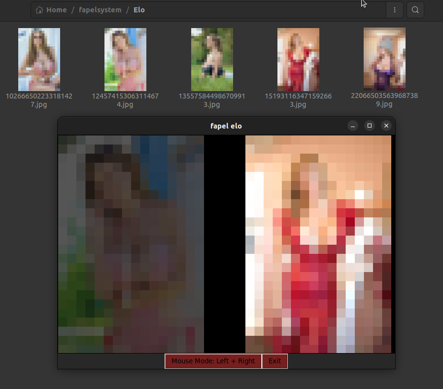

Now the former right image moved *before* the former left image in the directory. A new set of images is displayed to be ranked by you!

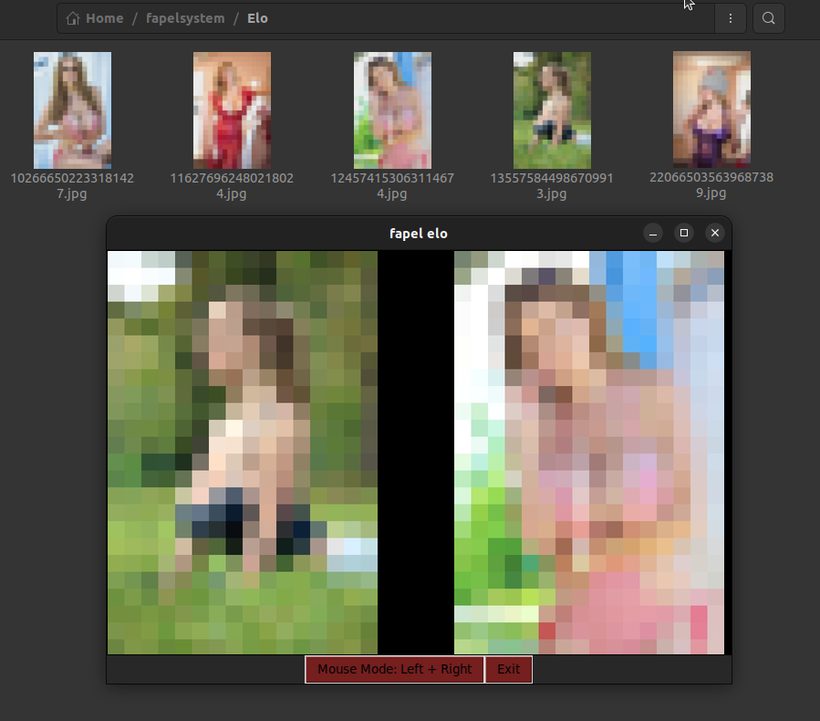

---

# TagPacks

You can install additionally Tags by using TagPacks.
TagPacks are basically CSV Table files containing which dirs should be created.

Use the tagPackInstall.py tool under /opt/fapelsystem/tools

Preview a tagPack file with `-s`, example:

`./tagPackInstall.py -s tagPack_Models_20220704a.csv`

Install it with (example):

`./tagPackInstall.py tagPack_Models_20220704a.csv`

These are some additional TagPacks:

> :eggplant: :sweat_drops: *Note: My TagPacks are not hosted on github because of their adult content*

## TagPacks with Models

[Go to TagPack Download](http://fapel-system.epizy.com/)

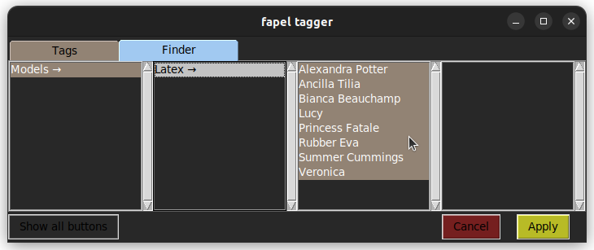

[Go to TagPack Download](http://fapel-system.epizy.com/)

## Feelings TagPack

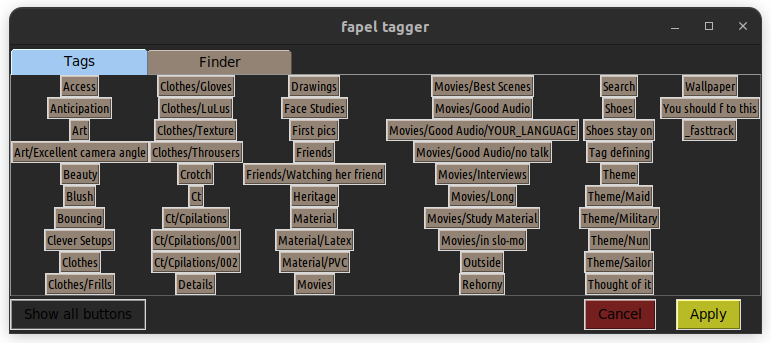

Category based on feelings. This TagPack installs additional counters (hard-c and justflow):

[Go to TagPack Download](http://fapel-system.epizy.com/)

## TagPack based on P.H. Categories

Inspired by the video platform P.H.

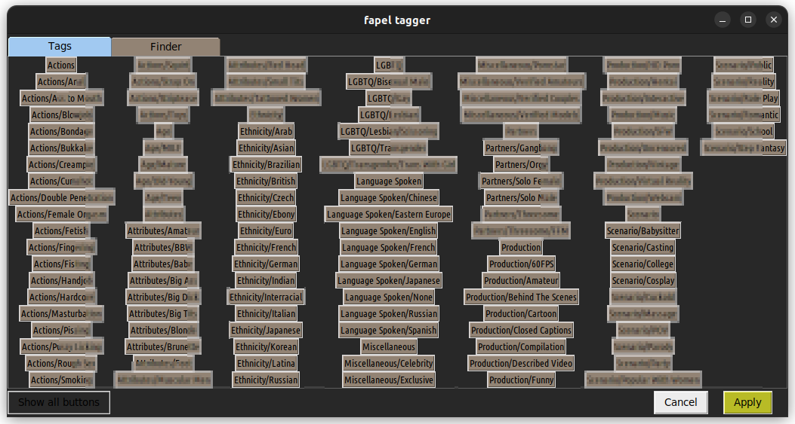

[Go to TagPack Download](http://fapel-system.epizy.com/)

---

# Technical stuff

## The config file

You find the config file under

`~/.config/fapel_system.conf`

## How files are organized in folders

Files are organizes in special folders, that are configured in the conf file.

All folder definitions in the config file must be absolut (starting from `/` or `~`).

### Fixed mandatory folders

| config group | config key| content of directory                                                 |
|--------------|-----------|----------------------------------------------------------------------|
|[dirs]|  tagDir   | Parent directory with Tags (directories) and media files |
|[dirs]|recycledDir|files you removed all tags from are placed in this "trash" folder|
|[dirs]|eloDir|Folder for the ranking system|
|[dirs]|searchResultDir|All searches are placed here with individual timestamp directories|
|[dirs]|fapsetDir|All sets of your today's favorites are placed here|

### Folders for counters

You can create as many counters as you like. They are individually called via a specifically named softlink to the script.

The softlink must point to

`/opt/fapelsystem/fapel_counter.py`

The name of the softlink must *end* with a key for the specific counter ("COUNTERID")

`Whatever_you-want_COUNTERID.py`

The key to your counter ist the `COUNTERID` (the last word preceeded by the last "`_`" or "`-`") 

This key must then be present in the config file:

| config group | config key| content of directory                                                 |
|--------------|-----------|----------------------------------------------------------------------|
|[countersDirs]|  COUNTERID   | Parent directory of counter COUNTERID |

## Tag directory dot files

Behaviour of the tagger for a Tag is controlled via (hidden) dot files.
All files are optional.

### .taginfo

The .taginfo file contains a tooltip that is shown in the fapel-tagger when you hoover over a button.

Its content is built like a config file an looks like

`[general]`

`tooltip=The tip text`

### .exclude_subdirs

If `.exclude_subdirs` is encountered, all subdirectories are not parsed for additional Tags and fapels / media files.
The file should be empty.

#### Example

You want to place a lot of images of a model inside the corresponding tag directory without parsing all these subdirectories.
To hide all the numbered "Set" dirs:

`/Tags/Models/Latex/Bianca Beauchamp/Set 001/`

`/Tags/Models/Latex/Bianca Beauchamp/Set 002/`

`...`

`/Tags/Models/Latex/Bianca Beauchamp/Set 245/`

we place a `.exclude_subdirs` file into the Bianca Beauchamp folder

### .hide-button

A Tag (a directory) with `.hide-button` in it will not show up as a button in the fapel-tagger unless you press the show all button.
It will still be visible in the finder.

### .hide-child-buttons

If `.hide-child-buttons` is encountered, no buttons for all subdirectories (so, sub-tags) are shown unless you press the show all button.

# There is more

... but this readme is not done yet...

# Remarks
remember that hardlinks do point to the same binary data of a file, altering it in one place alters it everywhere!

