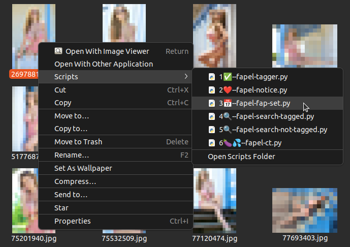
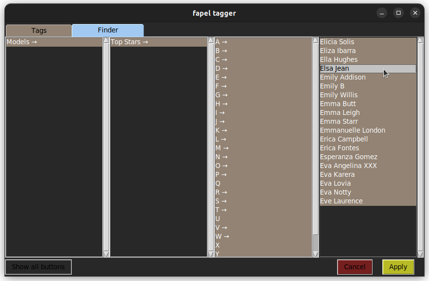

# Fapel-System - The Adult Media Organizer

**Tag, Rate and Enjoy your porn collection!**

:eggplant: :sweat_drops: :peach: :cherries: :movie_camera: :lollipop: :hotdog: :eggplant: :sweat_drops: :peach: :cherries: :movie_camera: :lollipop: :hotdog:

With the fapel-system you can organize your **adult images and video collection** under Linux and Windows with standard folders. Everything works with hardlinks.

The fapel-system was created and is optimized for adult-oriented images, videos and movies (Pornography / Porn / Pron). Fapel stands for "fap-able element" :-) If you are a passionate collector, this might be for you.

> :eggplant: :sweat_drops: *Note: All sample images on this page are censored*

---

# Start now!

- [Installation](#installation)
- [First steps!](#first-steps)
- [Advanced features](#advanced-features)
- [Technical stuff](#technical-stuff)

---

# Comparison with other Systems
advantages over database based systems

* works with every file type, jpg, gif, mov, mp4,...
* respects **your** privacy! No database, no server connection -- just your files! Dedicated to [Ancilla Tilia](https://en.wikipedia.org/wiki/Ancilla_van_de_Leest), former fetish model and privacy activist.
* backup compatible
* Survives itself (software not needed to browse categories, since these are normal folders)
* perfectly integrated into linux
* files can be renamed and moved (on the same drive) in any other program without problem
* everything is mouse only (one hand)
* fixed positions of tag buttons in the GUI, so you remember them by their location
* delete hardlinks without consequences

# Requirements

* Ubuntu Linux or Windows 10
    * all other linux systems might require you to install by hand
    * Ubuntu with Nautilus file manager (should be standard)
    * Windows 11 was not tested
* Python 3 with tkinter
* all folders and fapels must be on one logical drive because everything works with hardlinks
    * On Windows this needs to be an NTFS drive (Should be standard for internal drives). It does not work on external drives formatted with ExtFAT / FAT32!

You can check your drive properties if it is formatted with NTFS (the drive you have your media on):

---

# Installation

## Ubuntu Linux Installation

> :eggplant: :sweat_drops: *You can uninstall the previous version with the `uninstall_release_0_1_0alpha.sh` script.*

### 1. Clone or download this repo

Yes, clone or download this repo now!

### 2. Install python tkinter and pillow

`sudo apt-get install python3-tk python3-pil.imagetk`

### 3. Install fapelsystem via pip and install shortcuts and Tag dir

In the repo's root run

`chmod +x install_ubuntu.sh`

`./install_ubuntu.sh`

It installs fapelsystem via Python's PIP, creates the shortcuts in nautilus and if you want a basic tag directory structure.

> :cherries: *Do not run the install_ubuntu.sh as root (sudo), as it would create config files for root user and not for you*

> :eggplant: :sweat_drops: *If you are new then let the fapelsystem create the dirs (`y`). Otherwise you have to change the config file yourself (NOT recommended for new users!)*

### 4. Optional: Edit Config File to set up your own directories

Edit the config file

`~/.config/fapel_system.conf`

to use the directories you want.

## Windows Installation

### 1. Clone or download this repo

Yes, clone or download this repo now!

### 2. Install Python

Download and install Python 3

[https://www.python.org/downloads/windows/](https://www.python.org/downloads/windows/)

### 3. Install fapelsystem via pip and install shortcuts and Tag dir

Start (doubleclick) `install_windows.bat`

It installs fapelsystem via Python's PIP, creates the shortcuts in Explorer's "Send to" menu and if you want a basic tag directory structure.

> :eggplant: :sweat_drops: *If you are new then let the fapelsystem create the dirs (`y`). Otherwise you have to change the config file yourself (NOT recommended for new users!)*

### 4. Optional: Edit Config File to set up your own directories

Edit the config file

`[YOUR HOME DIRECTORY]\AppData\Roaming\Fapelsystem\fapel_system.conf`

to use the directories you want.

---

# First steps!

## Starting fapel_tagger

Now go to the media you like and start tagging!

I have this collection of images of Jordan Carver, let's add some tags!

Rightclick to start the tagger

Under Windows you find the tagger in the Send to submenu:

This is the fapel_tagger! It presents all tags for you as buttons you can press to select or deselect a tag!

There are almost no buttons... We are missing Tags! Let's create some!

## Create Tags

Go to

`~/fapelsystem/Tags/`

On Windows you find this folder in your home directory under documents.

And now just create directories and nested directories as you like! These are your Tags!

You can also delete directories (delete Tags) as you like.

## Add Tags to media

Back to the images, rightclick and start the fapel-tagger.

It will now automatically have all the tags you created (as directories). I have created a few:

Click the buttons, they will turn red. Red tags are selected.

Click Apply Button

The image is now tagged!

## Browse Media in Tags

Go to the Tag folder, in my example

`~/fapelsystem/Tags/Models/All purpose/Jordan Carver/`

There it is! The image was automatically hard-linked into the Tag folder!

## Tag multiple files

Of course you can tag more than one file in the go.

Just start the tagger with more files:

Here the tagger noticed that one file is already tagged (the buttons are blue). Let's add all the other files to the tags except tag "Beauty":

## Add a fav to a file ("notice a file")

Browsing through my collection, this shiny red image caught my attention:

Rightclicking and running the fapel-notice script!

This adds the image to the "notice dir":

Which as you can see ("0001" sub dir) remembers how often I started the "notice script" on the image!

The image will automatically move the numbered folders up!

Running notice script again:

Now it is in the sub folder "0002".

## "Enjoy" a media file

So, notice script counts "events" you noticed some file. The same is true for the "ct" script, except it's purpose is to count how many times you "enjoyed" a file ;-)

> :eggplant: :sweat_drops: *Note: Ct stands for "C.m to", not count, not computer tomography* :smirk:

Oh this beach wear image...

So clean the mouse and run the ct script!

Now run the tagger and see that the ct - counting directory is also present (Ct/Ct/0001)!

This is important to know:

* The ct directory is inside the /Tags folder, the /Notice directory is outside. So you only see the ct hardlinked media!
* BUT You only see the ct and numbered dirs when a file was tagged! This is to prevent cluttering the tag button gui.

> :peach: *Tip: If you want to see all buttons, press the button in the bottom left corner!*

# Advanced features

## Remember today's favorites

Maybe I find some pictures worth a second, condensed visit for today.
Or I want to collect some pictures for today's "enjoyment".

You can collect pictures in a separate directory, which is auto generated based on today's date.

So let's assume it's 2022-01-01 and pick some images:

This one

and this one

both times I use the "fapel fap set" script.

And I add some more pics.

This creates a folder based on today's date (here 2022-01-01) and puts the images into that folder:

There I can get to my today's favorites!

Nice feature: The "roll over" to the next day and thus the next folder happens not at 0:00 midnight but at 4:00 AM. You can configure that in the config file.

## Filter Tag Library to focus on topics

> :cherries: *This feature is currently not available under Windows*

> :peach: *Only tested with nautilus*

Sometimes you may do not want to see certain pictures or videos in your /Tags folder:

- My most favorable images may draw to much attention on them and I miss out other great images.

- I may not be in the mood for kinky stuff and do not want to see this part of my collection right now.

- I may just have enjoyed tentacle pron and now regret it and do not want to see it (temporarly... of course :smirk: )

The problem with these images is that they distract me by directing all the attention onto them.

The Filter system does theirfore not filter **on** specific media but filters **out** specific media.
It puts media into "exiles", these are here called "fapxiles".

You can define which media belongs to which fapxile.

> :peach: *Technically the filter is realized by dynamically creating .hidden files in all Tag folders. !!*

> :peach: *You have to switch "Show Hidden Files" off in your file manager, of course.*

Some examples:

### Filter Models
Within my /Material/Latex tag I also have some images of Princess Fatale. I really like these pictures and now they (she) distracts me (I want to open her pictures first).

Luckily I have tagged the images of Princess Fatale, so she has a separate Folder within the /Models Tag:

In this folder I create a hidden file named ".fapxile" with the content:

`[fapxileForThisTag]`

`[fapxileForFapelsOfThisTag]`

`Princess Fatale`

`[fapxileForSubTagsAndSubFapels]`

`Princess Fatale`

`[excludedSubTags]`

> :peach: *Pro tip: the git folder ./fapelsystem contains a template of this file called fapxile_file_template*

Now I start fapxile exile script...

> :peach: *You do not need to select a specific image and you can start this script everywhere.*

...and switch "Princess Fatale" to "hidden" and hit Apply.

After pressing F5 in the file manager, I do not see her pictures in the /Material/Latex Tag folder anymore.

### Filter most favorable fapels

Pictures I "enjoyed a lot" may be distracting because I see them first and not other good pictures near them.

I obviously enjoyed this red catsuit image of Lucy 0004 times.

It is also present in the /Material/Latex Tag and I want to focus on all the other good images.

When I activate the "ct" exile (which is preconfigured when you installed the fapel system with an inital tag folder), then all the media that is tagged with 0002 and more will be hidden.

Now this image and all the other media I enjoyed more than once is hidden:

### Show all fapels

If you want to see all media files again, you can switch off all fapxiles at once using the Show all Button in the left corner:

With this you will reset the selected fapxiles.

If you just want to quick check the hidden fapels without messing with your selected fapxiles, you can select *show hidden files* in the file manager's options menu:

## Search and filter tagged or untagged media

How to find out which images in this folder are tagged?

I go one folder up and run the "search tagged" script on the folder:

This creates a search folder based on current date and time (in this example it's 2022-01-01 12:34:56) and hardlinks all tagged media into it:

(Of course, the not-tagged script does the exact opposite ;-) )

## Search tagged source file

> :cherries: *This feature is currently not available under Windows*

All images within the /Tags folder are just hardlinks of your original images somewhere in your collection.

Sometimes you want to find the original image / file.

I obviously like this image of Jordan but I know there are more of her somewhere. I select her image and start the fapel-search-source-file script:

The script warns me that it will take a while.

This is because the fapel system is *not* a database and the script just starts a search using the linux commandline tool "find".

Select the base / root folder of you search. Normally this is the base folder of your collection.

The search did finish and opened up for me a new folder containing *soft*-links to all found images.

Number 0_ is always the original image I started the search from. So I select the 1_ image and start the open-softlink-folder script:

This script opens the folder with the image I searched and now I have found all the other pictures I was looking for!

## Rank your pictures

With the fapel_elo you can rank your images and decide which one is better (as in chess's ELO rating ;-) )

*(Again, bear in mind that the images on this page are censored -- of course normally you would see your images as you know them :-) )*

The GUI is quite simple: Two images from your Tags folder are presented at random.

While hoovering over the window:

- Press the left mouse button to favor the left image
- Press the right mouse button to favor the right image

> :eggplant: :sweat_drops: *Note: If you prefer to click on the images with your left mouse button only, press the "Mouse Mode" button to toggle the mouse behaviour. You then of course have to click on the winning image.*

To prevent accidential ranking you have to press the button 3 times. The *other* image will consequently dim until a new set of images is presented.

Your images are ranked in the elo folder (normally ~/fapelsystem/Elo/ ) by name (ascending numbering), so lowest number is the best!

### Example

In this example we have the elo program opened and the elo directory in the background.

Let's favorite the right image, which is currently lower ranked in the directory as the left image:

After clicking right to favor the right image, the left image starts to turn dark.

Now the former right image moved *before* the former left image in the directory. A new set of images is displayed to be ranked by you!

---

# TagPacks

> :cherries: *This feature is currently not available under Windows*

You can install additionally Tags by using TagPacks.
TagPacks are basically CSV Table files containing which dirs should be created.

Use the fapelsystem_tagPackInstall tool

Preview a tagPack file with `-s`, example:

`fapelsystem_tagPackInstall -s tagPack_Models_20220704a.csv`

Install it with (example):

`fapelsystem_tagPackInstall tagPack_Models_20220704a.csv`

These are some additional TagPacks:

> :eggplant: :sweat_drops: *Note: My TagPacks are not hosted on github because of their adult content*

## TagPacks with Models

[Go to TagPack Download](http://fapel-system.epizy.com/)

[Go to TagPack Download](http://fapel-system.epizy.com/)

## Feelings TagPack

Category based on feelings. This TagPack installs additional counters (hard-c and justflow):

[Go to TagPack Download](http://fapel-system.epizy.com/)

## TagPack based on P.H. Categories

Inspired by the video platform P.H.

[Go to TagPack Download](http://fapel-system.epizy.com/)

## Export Tags and create a TagPack file

Run

`fapelsystem_tagPackExport myTagPack.csv`

to export your Tag names to provide them for others.

You can edit the exported file using your favorite spreadsheet editor (Excel, Calc...).
All names are hidden using rot13. Use `-c` to export all names in clear text.
Use `-n` to add a NSFW flag to the file.

---

# Technical stuff

## The config file

You find the config file under

`~/.config/fapel_system.conf`

## GUI configuration

You can adjust the GUI with different config file settings.

### More Tags on Screen

If you have a lot of tags, you can make room for more tags on the screen. Change these two settings:

Increase the number of buttons per column:

`buttonsPerColumn=40`

Decrease the font size (e.g. 9 instead of 10):
`tagFontSize=9`

### Colors

Under the group `[colors]` you can adjust the GUI colors to your favorite ones!

## How files are organized in folders

Files are organizes in special folders, that are configured in the conf file.

All folder definitions in the config file must be absolut (starting from `/` or `~`).

### Fixed mandatory folders

| config group | config key| content of directory                                                 |
|--------------|-----------|----------------------------------------------------------------------|
|[dirs]|  tagDir   | Parent directory with Tags (directories) and media files |
|[dirs]|recycledDir|files you removed all tags from are placed in this "trash" folder|
|[dirs]|eloDir|Folder for the ranking system|
|[dirs]|searchResultDir|All searches are placed here with individual timestamp directories|
|[dirs]|fapsetDir|All sets of your today's favorites are placed here|

### Folders for counters

You can create as many counters as you like. They are individually called via a specifically named softlink to the script.

The softlink must point to

`[installdir]/fapel_counter.py`

> :eggplant: :sweat_drops: *Run `fapelsystem_printModuleDir` to print out the install dir on console.*

The name of the softlink must *end* with a key for the specific counter ("COUNTERID")

`Whatever_you-want_COUNTERID.py`

The key to your counter ist the `COUNTERID` (the last word preceeded by the last "`_`" or "`-`") 

This key must then be present in the config file:

| config group | config key| content of directory                                                 |
|--------------|-----------|----------------------------------------------------------------------|
|[countersDirs]|  COUNTERID   | Parent directory of counter COUNTERID |

## Tag directory dot files

Behaviour of the tagger for a Tag is controlled via (hidden) dot files.
All files are optional.

### .taginfo

The .taginfo file contains a tooltip that is shown in the fapel-tagger when you hoover over a button.

Its content is built like a config file an looks like

`[general]`

`tooltip=The tip text`

### .exclude_subdirs

If `.exclude_subdirs` is encountered, all subdirectories are not parsed for additional Tags and fapels / media files.
The file should be empty.

#### Example

You want to place a lot of images of a model inside the corresponding tag directory without parsing all these subdirectories.
To hide all the numbered "Set" dirs:

`/Tags/Models/Latex/Bianca Beauchamp/Set 001/`

`/Tags/Models/Latex/Bianca Beauchamp/Set 002/`

`...`

`/Tags/Models/Latex/Bianca Beauchamp/Set 245/`

we place a `.exclude_subdirs` file into the Bianca Beauchamp folder

### .hide-button

A Tag (a directory) with `.hide-button` in it will not show up as a button in the fapel-tagger unless you press the show all button.
It will still be visible in the finder.

#### Example

You have a directory that contains Tags describing different clothing materials: 

`/Tags/Material/Latex`

`/Tags/Material/Leather`

`/Tags/Material/PVC`

`...`

`/Tags/Material/Spandex`

You want to have the material itself as buttons ("Material/Latex", "Material/PVC") but not the Tag "Material" itself.
Place an empty file named ".hide_button" in the `/Tags/Material` folder.

You still can use the Tag "Material" when you use the finder and the Tag shows as a button when it is assigned to a file which is currently opened in the fapel tagger.

### .hide-child-buttons

If `.hide-child-buttons` is encountered, no buttons for all subdirectories (so, sub-tags) are shown unless you press the show all button.
They are still visible in the finder.

#### Example

You have a counter dir:

`/Tags/Videos/Watched completly/`

with it's automated subdirectories you count how often you completly watched a video:

`/Tags/Videos/Watched completly/0001`

`/Tags/Videos/Watched completly/0002`

`...`

`/Tags/Videos/Watched completly/0007`

Place an empty file named ".hide-child-buttons" in the `/Tags/Videos/Watched completly` folder.
If you also want to hide the `Watched completly` folder by itself, just *also* place an empty file named ".hide_button" in it, too.

# There is more

... but this readme is not done yet...

# Changelog

## Release April 2023

### Added

- Support for Windows including a batch-file based installer

### Changed

- fapel system program files are now installed locally via PIP

- installer for Ubuntu Linux was changed accordingly

## Release November 2022

### Added

- fapel_exiles.py Show and hide media based on mood or topic

- fapel_search_source_file.py Searchs for the original hardlinked media in your library.

- openLink.sh opens up the directory of a soft linked file

- tagPackInstall.py now asks if a counter should be installed

### Fixed

- install.sh now installs fapel_elo.py

### Security

- tagPackInstall.py now cannot leave the destination directory via /../ paths in a malicious tag pack file

# Remarks
remember that hardlinks do point to the same binary data of a file, altering it in one place alters it everywhere!

